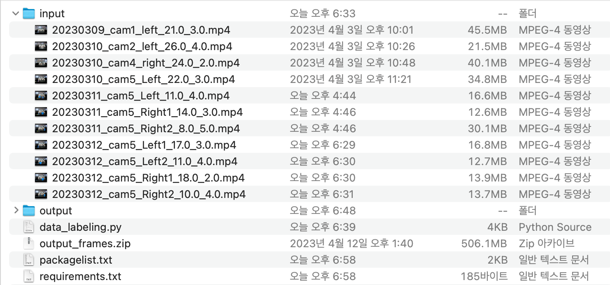

# Project
- This project aims to create frame-by-frame labeling with video based on opencv.
- 이 프로젝트는 opencv를 기반으로 비디오를 프레임 단위로 라벨링 생성하는 것을 목표로 합니다.

# Before Start


- You need to write your video name that way.
- 비디오 형식을 해당 방식으로 작성해야합니다.

    * definition
        - date_camnum_(Right/Left)_artificial insemination starting (second)_running time(second)
        - 비디오시간_카메라번호_왼쪽/오른쪽_인공수정시작시간(초)_진행되는 시간(초)

# Startting
```bash
$  python data_labeling.py input output
```
    python data_labeling.py --input_dir /Users/taehyunpark/onedrive_personal/OneDrive/university/4rd_1st\(2023spring\)/4.intelligence_system/lecture_materials/pig_trim_image/ --output_dir output
# Packages
 - anaconda3-2023.03
 - python 3.11.2
 - opencv 4.6.0

# Installation

* notice
    가상 환경에서 진행하는 것을 권장합니다.
```bash
$ sh install.sh
```
